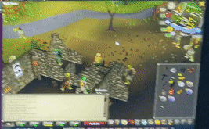

This is my attempt to learn Rust by programming a bot to play OldSchoolRuneScape for me. The two main inspirations for this bot were:

    - https://youngdp.medium.com/my-attempt-at-botting-in-runescape-63e9e61e47ed
    - https://www.youtube.com/watch?v=Uw11Lb8ov88

My goal was to create a general-ish framework that I could use to create lots of different scripts. To do this I wanted to play the game like a person, by looking at the screen, as opposed to programmatically hooking into the games state. In order to play I needed 2 primitives encapsulated in crates:

    - userinput - this crate emulates a user interacting with the computer. It can send keyboard and mouse pressses as well as move the mouse in a human-like manner between points.
    - screen - this crate handles retrieving screenshots as well as interpreting them.

# Running the bot

The bot requires some inputs in order to run properly. For the mouse controller to run it requires a library of movements from which to draw in order to make the mouse movements look human. This is done by recording your mouse as you move around which the controller then plays back. See 'userinput' crate for details on this.

The second thing needed are the bounds on the screen. This actually also requires a bit of setup in the game also, which will be covered later. The bot needs to know the position of the top-left and bottom-right pixel's of the screen. Note that these are not of the program's window, but of the game content (there is usually a gray border). I suggest taking a screenshot and using https://yangcha.github.io/iview/iview.html. Be careful to get this measurement correct.

# Game Setup

I played this game on RuneLite with a maching running Ubuntu 18.04 & 20.04:

    - wget https://github.com/runelite/launcher/releases/download/2.1.5/RuneLite.AppImage
    - chmod +x RuneLite.AppImage
    - Key Remapping - turn on for WASD to move camera with the RuneLite plugin.
    - Ground Items - turn off or only show if the value of the item is over 1M, otherwise clogs up the screen.
    - In Runescape options for Display switch to “The game client expands to fill the window”.
    - In Runescape options for Display make sure brightness is at the second darkest 2/4.

# Running in a VM

I was able to run a few bots simultaneously in VMs. I ran virtualbox with Ubuntu 20.04.

    1. To run virtualbox follow the installation instruction on the website. I ended up turning off secure boot.

    1. Download the .iso file of Ubuntu 20.04.

    1. Set up the machine:
        $ sudo apt-get update && sudo apt-get upgrade -y

        $ sudo apt-get install -y libx11-dev libxtst-dev libudev-dev libinput-dev build-essential wget curl vim gnome-tweak-tool git xcb libxcb-shm0-dev libxcb-randr0-dev xserver-xorg-core xserver-xorg-input-synaptics

    1. Install rust

    1. When running no Ubuntu 18.04 I had to enable 'uinput' to send signals to the machine, which I didn't need to do on 20.04. If needed see https://www.reddit.com/r/Ubuntu/comments/8fmqe0/uinput_doesnt_work_anymore_in_1804/dy4twtu/. I resolved this by running:

        $ sudo chmod 666 /dev/uinput

    1. Beware that if you clone the VM cargo may think the code is built, but it won't run properly. In this case simply try 'cargo clean' and then rebuild before deleting the VM.

# Development

An early example of the bot running. I gave it a FuzzyPixel to search for and click on. In this case I gave it the pixel of some goblin armor to start a fight.

Once we could find a target on the open screen we needed to be able to monitor our state so that we could take actions sequentially. This shows the bot finding a tree and then seeing that we got another log in the inventory and moving onto the next tree.

