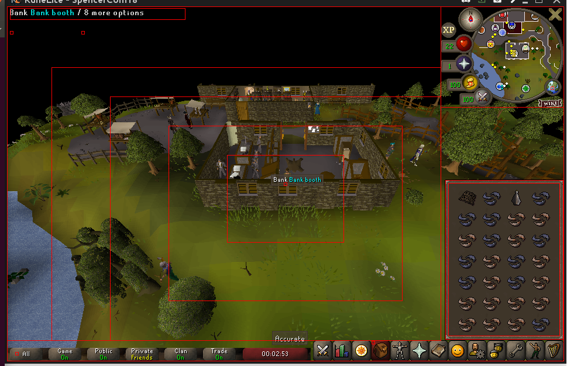
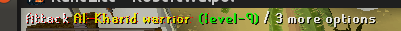
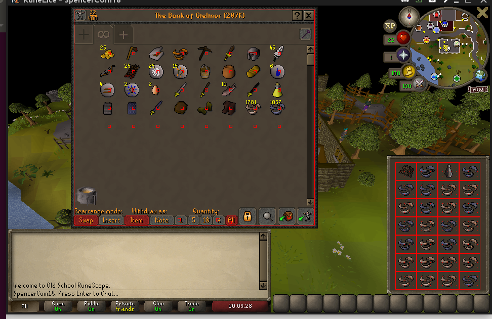
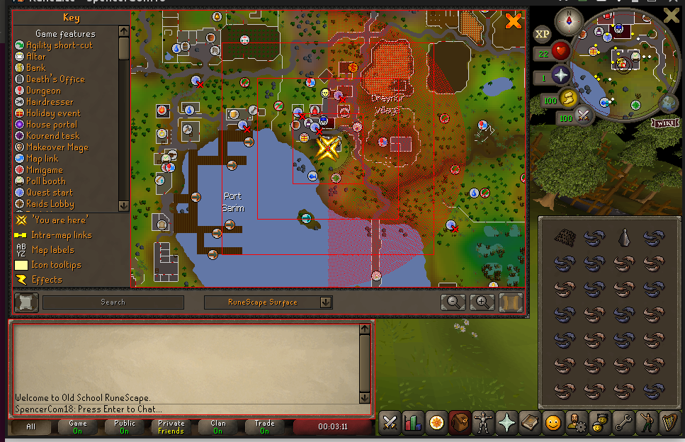

This crate is dedicated to handling the visual aspects of the RS bot. That means taking screenshots and finding objects of interest. Note this is all done by screenshotting and sampling pixels. There is no computer vision involved. This is mostly due to not finding libraries easily, but has the side effect of being fairly performant, if only mildly accurate.

One thing to note is that what the player/other players look like will effect us since we only see pixels on the screen.

# Screenshot

The basic input to the bot is a screenshot of OSRS. This is done using the scrap library, which gives us a screenshot as a GBRA rowwise vector. Example usage in the screenshot binary.

```
$ cargo run -p screen --bin screenshot -- --out-dir /path/to/dir/
```

# Get pixel value

Now that we can capture screenshots, we need to decide how to find our target within it. The search is done by finding relevant pixels (as opposed to full object detection). This is based on an assumption that OSRS graphics are simple enough for this to work. For this we have 2 options.

Move the mouse to an area of interest and get it's location and the pixel it is covering.
```
$ cargo run -p screen --bin print_mouse_pixel
```

Or you can take a saved image and use https://yangcha.github.io/iview/iview.html.

If you want to translate from pixel values to a visual - https://www.rapidtables.com/web/color/RGB_Color.html

# Find an object

Now that we have decided what to look for, we need to find it. We search for relevant pixels by giving a range of values that each channel can fall within (0-255 for each of blue, green, and red). We also give the region to look in.

```
$ cargo run -p screen --bin find_pixel_fuzzy -- --top-left 960,40 --past-bottom-right 1920,1040
```

# Checking the Inventory

Items in the inventory are placed at regular intervals and appear the same in each slot, so we are able to check if an item is an a given invetory slot. This is done by sampling pixels at a regular interval. This required constants for the inventory slot size and the distance between sampling points, since we manually record the points to be checked against.

To update the library of inventory items, you will update the inventory_slot_items in colors.rs. To do this uncomment the section with 'dbgstr' from the function 'check_inventory_slot' so that we will print out the pixel found at each of the points used to check the inventory slot. Then run bin/inventory.rs.

Note that there is a separate _bank variant for each item. This is because items seem to change their color slightly when the bank is open.

# Add Action Words

Action words are the words that appear in the top left of the screen describing what will happen if you left click. We use this to check that the action we are about to perform is correct. We "read" the text by approximating each letter with a set of points that sketch it. We assume a letter is fairly consistent in its shape, and placed at the same height. The width of letters and spaces does seem to vary.

To check letters use bin/action_words.rs, which will create a screenshot with red dots over the pixels checked.

```
$ RUST_BACKTRACE=1 cargo run -p screen --bin action_words -- --out-dir /path/to/screenshots/ --screen-top-left 965,54 --screen-bottom-right  1915,660
```

# Libraries with dependencies
scrap

I am dependent on runelight popping up icons such as shrimp on fishing spots. I'm not sure this is a bad dependency since if I was to play myself I would want these things.

# Screenshot examples

Here are screenshots of my bot with places of interested marked in red. The main things to notice are the concentric regtangles from the middle of the screen. These represent areas that are searched, from the center out, when looking for something on the open screen (e.g. a tree to cut). On the top left you see a box around the actions words, and below that are 2 boxes where an enemy's healthbar appears in combat.



This next one is a bit hard to see, but it is how we read the action we are about to take. The dots are where we expect the letters to be, and if they match it is the action we desire. This can easily mix up similar actions, but nonetheless proved quite useful in avoiding bad actions. This signal is mixed with finding a desired object in the open screen.



This is an image of the bank and inventory. We Have points for the centor of each bank slot, and at the quantities we use. For the inventory we were able to break down exactly where each slot is, and found that an item looks the exact same in each. So by sampling pixels in a slot (the dots for each space in the inventory) we can tell which item is there. This isn't 100% effective (pizza & anchovie pizza look the same), but it's pretty good. When the bank is open the colors change a bit, so we have regular and bank variants.



Here is a screenshot of the worldmap annotating it as well as the minimap and chatbox. The rectangles on the worldmap were the old way of searching in expanding regions. The dots that for an arc are the new way, which also form a circle on the minimap. This was to move out in a circular spiral as opposed to taking a rectangular section and randomly sampling pixels.

